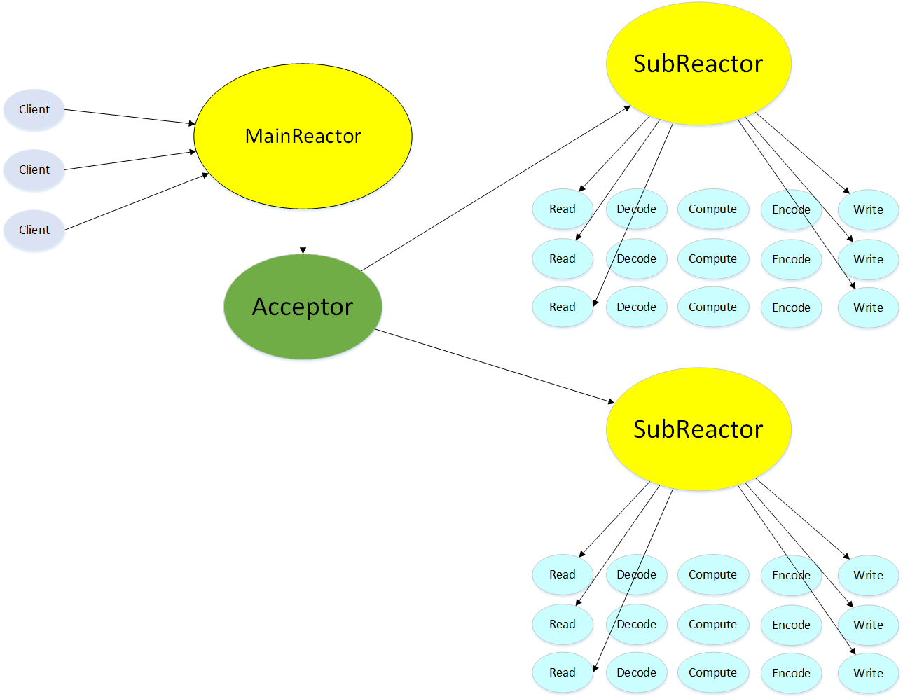

# tinyWS
A C++ Tiny Web Server

## 已完成

- 完成基本的Tcp（被动连接）库；
- 简易的HTTP服务器，可访问主页HTML和网站favicon图标。

## 技术

- 主从 Reactor 模式：
    - 主 Reactor 负责监听连接，当有新的连接，accept 到新的 socket 后，使用 Round Robin 方法选择从 Reactor，将 socket 派发给从 Reactor；
    - 从 Reactor 负责管理时间描述符（timerfd 用于定时任务）、事件描述符（eventfd 用于唤醒 IO 线程）和 派发过来的 socket 文件描述符。
- multiple Reactors + thread pool (one loop per thread + process pool)； 
- EventLoop：使用 Epoll 水平触发的模式结合非阻塞 IO；
- 进程池池：
    - 使用多进程能发挥多核的优势；
    - 进程池可以避免线程的频繁地创建和销毁的开销。
- 使用智能指针等 RAII 机制，来为降低内存泄漏的可能性；

## 并发模型

并发模型为 multiple reactors + process pool (one loop per process + process pool)； + 非阻塞 IO，新连接使用 Round Robin 策略派发。

## 参考

- [陈硕老师的Blog](http://www.cppblog.com/solstice/)
- [linyacool](https://github.com/linyacool)的[WebServer](https://github.com/linyacool/WebServer)
- [uv-cpp](https://github.com/wlgq2/uv-cpp)
- [开源HTTP解析器](https://www.cnblogs.com/arnoldlu/p/6497837.html)
- [HTTP请求和响应格式](https://www.cnblogs.com/yaozhongxiao/archive/2013/03/02/2940252.html)
- [写一个并发http服务器](https://zhuanlan.zhihu.com/p/23336565)（有代码）
- [有什么适合提高 C/C++ 网络编程能力的开源项目推荐？ - Variation的回答 - 知乎](https://www.zhihu.com/question/20124494/answer/733016078)（master/worker、proactor 等 IO 模型）
- [Reactor事件驱动的两种设计实现：面向对象 VS 函数式编程](http://www.cnblogs.com/me115/p/5088914.html)
- [网络编程中的关键问题总结](https://www.cnblogs.com/me115/p/5092091.html)
- [muduo源码剖析 - cyhone的文章 - 知乎](https://zhuanlan.zhihu.com/p/85101271)
- [Muduo 源码分析](https://youjiali1995.github.io/network/muduo/)