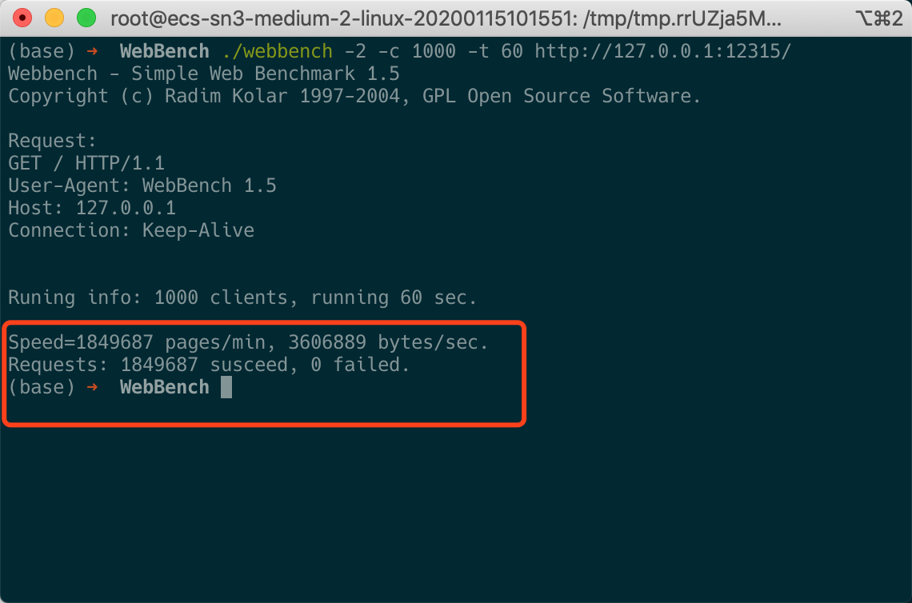

# 压力测试

## 测试环境

### 华为云虚拟主机

- OS: Ubuntu 18.04 LTS
- CPU: 1核
- 内存：2M

## 测试方法

- 为了避免带宽带来的影响，将服务器程序和 WebBench 程序都运行在同一台主机上。
- 使用工具 Webbench，开启 1000 客户端进程，时间为 60s。
- 分别测试短连接和长连接的情况。
- 为避免磁盘 IO 对测试结果的影响，测试响应为内存中的"Hello World"字符加上必要的HTTP头。
- 因为发送的内容很少，为避免发送可能的延迟，禁用 Nagle 算法。
- 创建 4 个子进程。

## 测试结果

| 短连接QPS | 长连接QPS |
| --------- | --------- |
| 7650      | 30828     |

处理请求数方面，长连接比短连接能很多，多了 4 倍。

## 测试结果截图

- 短连接

- 长连接

## 参考

- [linyacool](https://github.com/linyacool)的[WebServer](https://github.com/linyacool/WebServer)中的[测试及改进]([https://github.com/linyacool/WebServer/blob/HEAD/%E6%B5%8B%E8%AF%95%E5%8F%8A%E6%94%B9%E8%BF%9B.md](https://github.com/linyacool/WebServer/blob/HEAD/测试及改进.md))。
- [WebBench](https://github.com/linyacool/WebBench)来自[linyacool](https://github.com/linyacool)的[WebServer](https://github.com/linyacool/WebServer)。